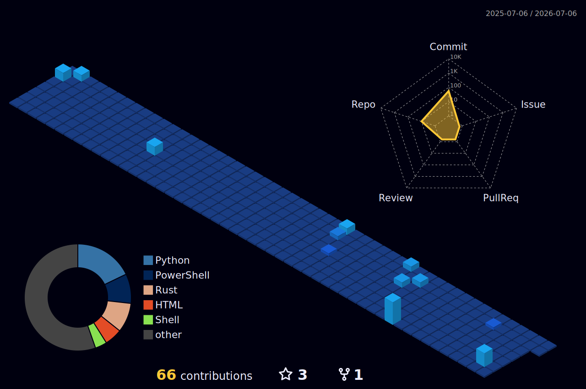

---

Offensive security researcher focused on malware development, EDR evasion, and vulnerability research.
**5 CVEs authored · H2HC 2024 Speaker · Security Professor**

---
## CVE Research
| CVE | Target | Type | Severity |
|-----|--------|------|----------|
| [CVE-2024-26477](https://nvd.nist.gov/vuln/detail/CVE-2024-26477) | Statping-ng v0.91.0 | Privilege Escalation | Critical |
| [CVE-2024-26478](https://nvd.nist.gov/vuln/detail/CVE-2024-26478) | Statping-ng v0.91.0 | Account Takeover | High |
| [CVE-2024-26479](https://nvd.nist.gov/vuln/detail/CVE-2024-26479) | Statping-ng v0.91.0 | Information Disclosure | Medium |
| [CVE-2024-26480](https://nvd.nist.gov/vuln/detail/CVE-2024-26480) | Statping-ng v0.91.0 | Remote Code Execution | High |
| [CVE-2023-50465](https://nvd.nist.gov/vuln/detail/CVE-2023-50465) | MonicaHQ | Stored XSS via SVG | Medium |
---
## Certifications

---
## Speaking & Teaching
- **H2HC 2024** — Presented at Hackers to Hackers Conference, the largest security conference in Latin America
- **Professor** — Ethical Hacking (undergraduate) · Purple Team (postgraduate)
---
## Stack

---

|  |
| --- |
|  |
| --- |

